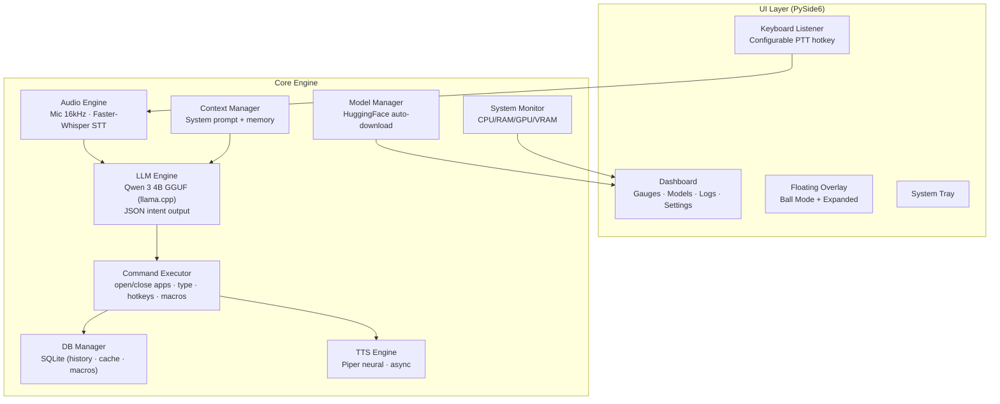
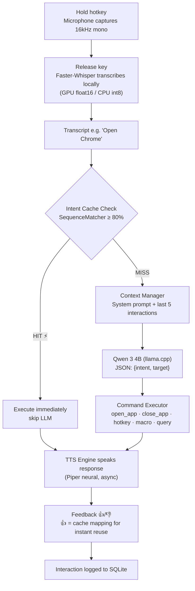

<p align="center">
  
</p>
<h1 align="center">GriffinX: Your Local AI Assistant</h1>
<p align="center">
  <strong>Voice-controlled desktop assistant that runs entirely on your machine</strong><br/>
  <em>Hold a hotkey → speak naturally → GriffinX transcribes, thinks, acts, and speaks back — all offline</em>
</p>

<p align="center">
  
  
  
  
  
  
</p>

---

## Table of Contents

- 🔍 [Overview](#overview)
- 🎯 [Why GriffinX?](#why-griffinx)
- ✨ [Features](#features)
- 🏗 [Architecture](#architecture)
- 🔄 [Pipeline Flow and How It Works](#pipeline-flow-and-how-it-works)
- 🏃 [Application Walkthrough](#application-walkthrough)
- 📊 [Model Pipeline and Hardware Adaptation](#model-pipeline-and-hardware-adaptation)
- ⚡ [Smart Intent Cache](#smart-intent-cache)
- 🎨 [UI Guide](#ui-guide)
  - [Dashboard](#dashboard)
  - [Ball Mode (Default)](#ball-mode-default)
  - [Expanded Overlay](#expanded-overlay)
  - [System Tray](#system-tray)
- ⚙️ [Command Executor and App Resolution](#command-executor-and-app-resolution)
- 🚀 [Quick Start](#quick-start)
- 🔧 [Hardware-Accelerated LLM Setup](#hardware-accelerated-llm-setup)
- 📦 [Build Standalone EXE and Packaging Notes](#build-standalone-exe-and-packaging-notes)
- 📁 [Project Structure and Key Components](#project-structure-and-key-components)
- 📚 [Dependencies](#dependencies)
- ⚙️ [Configuration](#configuration)
- 🗺️ [Roadmap](#roadmap)
- ⚠️ [Troubleshooting](#troubleshooting)
- 👤 [Author](#author)

---

## Overview

**GriffinX** is a Windows desktop assistant that lets you control your PC with your voice while keeping all inference local. It listens through push-to-talk, transcribes speech with a local Whisper model, classifies your intent with a local Qwen 3 4B LLM running via `llama.cpp`, executes desktop actions (open/close apps, type text, press hotkeys, run macros), learns from your feedback, and speaks back using offline Piper neural text-to-speech.

No cloud is required for normal use. Model files (~4 GB total) are downloaded on first run and then loaded from the local `models/` folder.

> GriffinX is **CPU-first by design**. A GPU is optional — it accelerates inference but is never required. The built EXE runs on **both CPU-only and NVIDIA GPU** systems without modification. The app runs on any Windows 10/11 machine with 16 GB RAM.

---

## Why GriffinX?

> **Most AI assistants either live in a browser or depend on cloud APIs. GriffinX gives you direct desktop control — offline.**

| | Cloud AI Assistants | GriffinX |
|---|---|---|
| **Workflow** | Open browser → type prompt → wait → copy result | Hold hotkey → speak → GriffinX acts immediately |
| **Privacy** | Voice and commands sent to cloud servers | Everything stays on your machine — STT, LLM, TTS, history |
| **Desktop Control** | Text-only responses, no system actions | Opens/closes apps, types text, presses hotkeys, runs macros |
| **Learning** | Stateless — no memory of your habits | Intent cache learns from feedback — repeated commands skip LLM |
| **Offline** | Requires constant internet | Works fully offline after one-time model download |
| **Latency** | Network round-trip per request | Direct local inference — sub-second for cached commands |
| **Voice Output** | Browser-based TTS or none | Offline neural TTS via Piper — natural-sounding speech |

---

## Features

### 🎙️ Voice Input
| Feature | Description |
|---|---|
| **Push-to-Talk** | Customisable hotkey (default: `Ctrl + CapsLock`) — change in Dashboard settings |
| **Local STT** | Faster-Whisper Medium English — runs on GPU (float16) or CPU (int8) |
| **Command Priming** | Transcription prompt biased toward common commands and app names for better accuracy |
| **VAD Filtering** | Voice Activity Detection filters silence — min 500ms silence threshold |
| **No Key Suppression** | The trigger key still functions normally — CapsLock toggles, Space types, etc. |

### 🧠 Intent Classification
| Feature | Description |
|---|---|
| **Local LLM** | Qwen 3 4B (Q4_K_M GGUF) via `llama-cpp-python` — 4-bit quantized, ~2.5 GB |
| **Auto-Download** | LLM model downloads automatically on first launch with progress in Dashboard |
| **Structured Output** | LLM outputs JSON with `intent` and `target` fields |
| **Think-Block Stripping** | Automatically removes Qwen 3's `<think>` reasoning blocks |
| **Robust JSON Parsing** | Handles code fences, nested objects, and partial outputs |
| **GPU Auto-Offload** | `n_gpu_layers=-1` offloads all layers to GPU when available |

### ⚡ Smart Intent Cache
| Feature | Description |
|---|---|
| **Feedback-Driven** | Only verified-correct commands are cached |
| **Fuzzy Matching** | SequenceMatcher-based similarity (80% threshold, 90% for short commands) |
| **Cache-First Pipeline** | Cached commands skip LLM inference entirely — instant execution |
| **Use Counting** | Tracks how often each cached mapping is used |

### 🖥️ Desktop Actions
| Feature | Description |
|---|---|
| **App Launch** | Opens any app via dynamic Start Menu/Desktop shortcut scanning |
| **App Close** | Kills processes by executable name via `taskkill` |
| **Text Typing** | Types text into the active window via `pyautogui` |
| **Hotkeys** | Presses keyboard shortcuts (e.g., `ctrl+s`, `alt+f4`) |
| **Script Execution** | Runs `.py` scripts (safety-restricted to Python files only) |
| **Delay** | Timed pauses during macro playback (max 30 seconds) |

### 🔁 Macro System
| Feature | Description |
|---|---|
| **Voice-Created** | Say "Create a macro called morning setup" to save recent actions |
| **Voice-Triggered** | Say "Run the macro morning setup" to replay |
| **Hotkey-Bound** | Macros can be assigned global hotkeys for instant trigger |
| **History-Derived** | Macros are built from the last N successful actions in the interaction log |
| **SQLite-Persisted** | Stored in the local database — survive restarts |

### 🔊 Text-to-Speech
| Feature | Description |
|---|---|
| **Piper Neural TTS** | Offline neural synthesis — Lessac Medium voice (22050 Hz, 16-bit mono) |
| **Async Playback** | Speech runs in a background thread — never blocks the UI |
| **WAV Pipeline** | Synthesizes to in-memory WAV buffer → PCM16 → float32 → `sounddevice` |

### Dashboard (Command Centre)
| Feature | Description |
|---|---|
| **System Gauges** | Real-time CPU, RAM, GPU, VRAM dials — GPU shows N/A gracefully on CPU-only |
| **AI Model Cards** | Status per model (STT, LLM, TTS) with 16px progress bars and % during download |
| **Activity Log** | Timestamped feed of downloads, engine init, command execution, errors |
| **Settings** | Start-at-startup toggle, customisable push-to-talk hotkey (2-3 key combos) |
| **80% Screen Launch** | Dashboard opens centred at 80% of screen width & height |
| **Golden-Brown Theme** | Premium warm aesthetic with gold-glow accents on interactive elements |
| **Always-On Tray** | Closing the dashboard silently minimises to system tray — no notification |

### Floating Overlay & Ball Mode
| Feature | Description |
|---|---|
| **Ball Mode Default** | GriffinX starts as a compact branded ball — single-click opens text input, double-click expands |
| **Right-Click Menu** | Context menu on the ball: Open Dashboard / Quit |
| **Expanded Overlay** | Translucent glassmorphic panel with status, transcript, and response |
| **Logo Click** | Click the header logo in expanded mode → opens Dashboard (hand cursor) |
| **× Close Button** | Circular golden button collapses back to Ball Mode |
| **Neon Animations** | Green pulse when listening; cyan sweep when thinking; amber breathing at idle |
| **Feedback Buttons** | 44px 👍/👎 centred below the ball or above text input — fully visible |
| **Draggable** | Click and drag to reposition anywhere on screen |
| **Click Delay** | 300ms delay on single-click prevents accidental text input triggers |

---

## Architecture



<details>
<summary>ASCII fallback (click to expand)</summary>

```
┌──────────────────────────────────────────────────────────────────────┐
│                      GriffinX Desktop App                            │
│                                                                      │
│  ┌────────────────┐    ┌──────────────────────────────────────────┐  │
│  │   Keyboard     │    │        UI Layer (PySide6)                │  │
│  │   Listener     │    │                                          │  │
│  │                │    │  ┌──────────┐  ┌──────────┐ ┌────────┐   │  │
│  │ Configurable   ├───►│  │ Dashboard│  │ Floating │ │ System │   │  │
│  │ push-to-talk   │    │  │ (gauges, │  │ Overlay  │ │ Tray   │   │  │
│  │ hotkey         │    │  │  models, │  │ (ball +  │ │ Icon   │   │  │
│  │                │    │  │  logs,   │  │  expand) │ └────────┘   │  │
│  └────────────────┘    │  │  settings│  └────┬─────┘              │  │
│                        │  └──────────┘       │                    │  │
│                        └─────────────────────┼────────────────────┘  │
│                                              │                       │
│  ┌───────────────────────────────────────────┼────────────────────┐  │
│  │                     Core Engine                                │  │
│  │                                                                │  │
│  │  ┌──────────────┐  ┌──────────────┐  ┌────────────────────┐    │  │
│  │  │ Audio Engine │  │ LLM Engine   │  │ Command Executor   │    │  │
│  │  │ Microphone   │  │ Qwen 3 4B    │  │ open/close apps    │    │  │
│  │  │ 16kHz mono   │  │ GGUF via     │  │ type text          │    │  │
│  │  │ Faster-      │  │ llama.cpp    │  │ press hotkeys      │    │  │
│  │  │ Whisper STT  │  │ JSON intent  │  │ macro playback     │    │  │
│  │  └──────────────┘  └──────────────┘  └────────────────────┘    │  │
│  │                                                                │  │
│  │  ┌──────────────┐  ┌──────────────┐  ┌────────────────────┐    │  │
│  │  │ Context      │  │ DB Manager   │  │ Macro Manager      │    │  │
│  │  │ Manager      │  │ SQLite:      │  │ Create, bind       │    │  │
│  │  │ System       │  │ history,     │  │ hotkeys, replay    │    │  │
│  │  │ prompt +     │  │ intent cache │  └────────────────────┘    │  │
│  │  │ memory       │  │ macros       │                            │  │
│  │  └──────────────┘  └──────────────┘                            │  │
│  │                                                                │  │
│  │  ┌──────────────┐  ┌──────────────┐  ┌────────────────────┐    │  │
│  │  │ TTS Engine   │  │ Model        │  │ System Monitor     │    │  │
│  │  │ Piper neural │  │ Manager      │  │ CPU/RAM/GPU/VRAM   │    │  │
│  │  │ offline      │  │ Auto-download│  │ real-time gauges   │    │  │
│  │  │ synthesis    │  │ from HF      │  │ (pynvml optional)  │    │  │
│  │  └──────────────┘  └──────────────┘  └────────────────────┘    │  │
│  │                                                                │  │
│  │  ┌──────────────┐  ┌──────────────┐                            │  │
│  │  │ Settings     │  │ Startup      │                            │  │
│  │  │ JSON atomic  │  │ Manager      │                            │  │
│  │  │ persistence  │  │ Win Registry │                            │  │
│  │  └──────────────┘  └──────────────┘                            │  │
│  └────────────────────────────────────────────────────────────────┘  │
└──────────────────────────────────────────────────────────────────────┘
```

</details>

---

## Pipeline Flow and How It Works

### High-Level Path Diagram



<details>
<summary>ASCII fallback (click to expand)</summary>

```
Hold hotkey (configurable) → Microphone captures 16kHz mono audio
     │
     ▼
Release key → Audio sent to Faster-Whisper (GPU float16 / CPU int8)
     │            Transcription prompt primes for command vocabulary
     ▼
Transcript: "Open Chrome"
     │
     ├──► Intent Cache Check (SequenceMatcher ≥ 80% similarity)
     │         │
     │    ┌────┴─────┐
     │    │ HIT      │ → Execute immediately (skip LLM) → ⚡ instant
     │    │ MISS     │ → Continue to LLM ↓
     │    └──────────┘
     │
     ▼
Context Manager assembles system prompt + last 5 interactions
     │
     ▼
Qwen 3 4B (llama.cpp) → JSON output: {"intent":"open_app","target":"chrome"}
     │                    Think-blocks stripped, robust JSON extraction
     ▼
Command Executor routes intent:
  → open_app: resolve target → subprocess.Popen via cmd.exe start
  → close_app: taskkill /IM target.exe /F
  → string_type: pyautogui.write(target)
  → hotkey: pyautogui.hotkey(*keys)
  → macro_creation: save last N actions to SQLite
  → macro_execution: replay saved action sequence
  → general_query: return LLM's text response
     │
     ▼
TTS Engine speaks response (Piper neural, async thread)
     │
     ▼
Feedback buttons appear (👍/👎) → positive = cache the mapping
     │
     ▼
Interaction logged to SQLite (timestamp, input, intent, status, feedback)
```

</details>

### General Processing Overview

1. **You hold the hotkey and speak** — `Ctrl + CapsLock`. GriffinX records from your default microphone at 16 kHz mono.
2. **You release the key** — Recording stops. The audio is sent to the local Faster-Whisper model for transcription. A command vocabulary prompt biases recognition toward app names and common actions.
3. **The transcript goes to the intent engine** — First, GriffinX checks the intent cache for a fuzzy match (≥80% similarity). If found, it skips the LLM entirely and executes instantly. If not, the Qwen 3 4B model classifies the command into a structured JSON intent.
4. **GriffinX executes the action** — Opens an app, types text, presses a hotkey, runs a macro, or answers a question.
5. **GriffinX speaks the result** — Using offline Piper neural TTS.
6. **You confirm with feedback** — 👍 caches the mapping for instant future use. 👎 logs it as incorrect.

If you don't use voice, you can type commands directly into the overlay's text box. The only skipped step is speech-to-text.

---

## Application Walkthrough

### Starting GriffinX

When you launch `main.py` (or `GriffinX.exe`), the following orchestration process takes place:

1. **Configuration Load**: `config.json` is loaded to fetch model paths, device settings, and cache thresholds.
2. **Database Initialization**: The SQLite database opens at `logs/history.db` to handle interaction history, the intent cache, and macros.
3. **Dashboard Opening**: The Dashboard opens immediately, centered at 80% of screen width and height, displaying real-time system gauges and model status cards.
4. **Overlay Launch**: The floating ball appears in the bottom-right corner as the default compact interaction node.
5. **System Tray Integration**: A tray icon is registered with the branded `GriffinX.ico` file.
6. **Background Model Downloads**: Parallel background threads initiate download processes for Whisper, Qwen 3, and Piper TTS, displaying percentages and progress bars in the Dashboard.
7. **Audio Engine Preparation**: Microphone inputs are mapped and the Whisper engine prepares for lazy-loading on the first voice command.
8. **LLM Engine Preparation**: The Qwen GGUF model path is configured, ready to load on the first intent classification.
9. **TTS Engine Init**: Piper voice files are loaded (or TTS is disabled gracefully if models are missing).
10. **Hotkey Hooks**: The global keyboard hooks register the push-to-talk key combination (default: `Ctrl + CapsLock`) without suppressing the baseline keys.

### Closing & Minimizing

- **Close Dashboard**: Clicking the close window button silently minimizes the dashboard to the system tray.
- **Quit GriffinX**: Right-clicking the floating ball or system tray icon and selecting "Quit" terminates the application and unhooks all keyboard hooks.
- **Collapse Overlay**: Clicking the `×` button on the expanded overlay collapses it back to Ball Mode.
- **Tray Toggle**: Double-clicking the tray icon restores/opens the Dashboard.

---

## Model Pipeline and Hardware Adaptation

GriffinX ships without large model files. On first use it downloads three models with live progress in the Dashboard:

| Model | Engine | Size | Purpose | Local Path |
|---|---|---|---|---|
| Faster-Whisper Medium English | CTranslate2 | ~1.5 GB | Speech-to-text | `models/faster-whisper-medium.en/` |
| Qwen 3 4B (Q4_K_M GGUF) | llama.cpp | ~2.5 GB | Intent classification & chat | `models/Qwen_Qwen3-4B-Q4_K_M.gguf` |
| Piper Lessac Medium | ONNX Runtime | ~15 MB | Text-to-speech | `models/en_US-lessac-medium.onnx` |
| Piper voice config | ONNX Runtime | ~1 KB | TTS voice configuration | `models/en_US-lessac-medium.onnx.json` |

### Hardware Adaptation

The application auto-detects system resources to optimize model deployment:

| Hardware | Whisper | LLM | TTS | Dashboard GPU Gauges |
|---|---|---|---|---|
| **NVIDIA GPU** | CUDA, float16 | All layers on GPU (`n_gpu_layers=-1`) | CPU (ONNX) | Active (pynvml) |
| **AMD GPU** | CPU, int8 | Vulkan backend (via install.py) | CPU (ONNX) | N/A |
| **CPU only** | CPU, int8 | CPU inference | CPU (ONNX) | N/A |

To pre-download all models before launching the visual application:

```powershell
uv run python download_models.py
```

---

## Smart Intent Cache

The intent cache is the core learning system of GriffinX. When a user marks an action as successful (clicking the 👍 button), the exact transcription-to-intent mapping is cached. Future inputs that match a cached pattern bypass the LLM entirely, yielding sub-second execution speeds.

### Similarity Thresholds

A fuzzy matching algorithm (`SequenceMatcher`) checks spoken input against the cache:

| Command Length | Threshold | Reasoning |
|---|---|---|
| < 8 words | 90% similarity | Short commands require tighter constraints to prevent false execution. |
| ≥ 8 words | 80% similarity | Longer commands allow more semantic and structural variance. |

### Match Scenarios

| Spoken Command | Cached Entry | Similarity | Result |
|---|---|---|---|
| *"Open Chrome"* | *"Open Chrome"* | 100% | **HIT** (Skip LLM) |
| *"Open Google Chrome"* | *"Open Chrome"* | ~82% | **HIT** (Skip LLM) |
| *"Open Brave"* | *"Open Chrome"* | ~55% | **MISS** (Passes to LLM) |

---

## UI Guide

### Dashboard

The Dashboard is the control center of GriffinX. It splits into a 5:2 column layout:
* **Primary (Left)**: Circular system resources (CPU, RAM, GPU, VRAM) alongside status cards for the three AI engines.
* **Secondary (Right)**: Timestamped activity feed log and setting options (startup toggle, hotkey editor).

#### AI Model Cards
Display engine status using colored icons (✅ ready, ⏳ downloading, ❌ failed) accompanied by a 16px progress bar with a golden gradient fill and centered text.

#### System Gauges
Monitored via `psutil` (for CPU/RAM) and optional `pynvml` (for GPU/VRAM). If an NVIDIA card is absent, GPU resource meters show "N/A" gracefully.

#### Hotkey Editor
A click-to-capture interface that updates settings atomically and dynamically re-registers global system hooks.

---

### Ball Mode (Default)

GriffinX starts as a compact floating circle utilizing `trixie-circular.jpeg`.

* **Single-click**: Opens or closes a quick-input text bar (includes a 300ms click delay to prevent accidental inputs while dragging).
* **Double-click**: Expands the interface to the Translucent Overlay.
* **Right-click**: Context menu (Open Dashboard, Quit).
* **Repositioning**: Draggable anywhere on the screen.

#### Animation Rings
* **Idle**: Amber breathing ring.
* **Listening**: Green pulsing ring.
* **Transcribing**: Green spinning arc.
* **Thinking / Executing**: Cyan spinning arc.

#### Feedback & Responses
- **👍/👎 Buttons**: Centered below the ball (44x44px target) to confirm cache additions.
- **Speech Bubble**: Appears above the ball for text readouts. Auto-hides based on word count (5 seconds for short responses, up to 15 seconds for long text).

---

### Expanded Overlay

A glassmorphic, translucent, always-on-top panel that grows dynamically to fit multi-line transcripts:

* **Header Logo**: Features the GriffinX logo. Left-clicking it opens the Dashboard.
* **Collapse (`×`) Button**: Restores Ball Mode.
* **Status Dot**: Indicates operational state (🟢 Listening, 🟡 Thinking, ⚪ Idle, 🔴 Error).
* **Logs & Content**: Dedicated rows for "YOU:" (user transcript) and "GriffinX:" (output/chat response).
* **Inputs**: Command text box centered at the bottom of the overlay.

---

### System Tray

A background system node matching the branded `GriffinX.ico`:

* **Double-click**: Direct restoration of the Dashboard.
* **Context Options**: Restores/hides overlay, triggers push-to-talk listening, or executes a clean application exit.

---

## Command Executor and App Resolution

For intents matching `open_app` or `close_app`, the execution layer maps user utterances to desktop processes via a structured resolution ladder:

```
1. Direct Whitelist Match (Matches key e.g., "chrome" -> "chrome.exe")
      │
      ▼
2. Absolute File Path Check (Verifies if input targets a local path directly)
      │
      ▼
3. Fuzzy Whitelist Check (Checks key substrings e.g., "google chrome")
      │
      ▼
4. Dynamic Shortcut Scan (Resolves shortcuts registered from Start Menu & Desktop)
      │
      ▼
5. Operating System Fallback (Passes target as-is to Windows shell "start")
```

### Dynamic App Discovery

During boot, GriffinX crawls the following directories for shortcut (`.lnk`) files, registering them into the execution lookup table:
* `%ProgramData%\Microsoft\Windows\Start Menu\Programs\`
* `%APPDATA%\Microsoft\Windows\Start Menu\Programs\`
* `%PUBLIC%\Desktop\`
* `%USERPROFILE%\Desktop\`

### Built-in Whitelist Examples

- **Notepad**: `notepad.exe`
- **Google Chrome**: `chrome.exe`
- **VS Code**: `code.exe`
- **Windows Terminal**: `wt.exe`
- **Settings**: `ms-settings:`

### Safety Restrictions
* Macro playback delays are capped at 30 seconds.
* Script running is strictly restricted to `.py` extension targets.
* PyAutoGUI failsafe is enabled (shoving the mouse cursor to any corner of the screen aborts macro executions).

---

## Quick Start

### Prerequisites

- Windows 10/11
- Python 3.10+
- [`uv`](https://docs.astral.sh/uv/) package manager
- 16 GB RAM recommended
- GPU optional (NVIDIA CUDA or AMD Vulkan); CPU mode is the default baseline

### Install & Run

```powershell
# 1. Clone the repository
git clone https://github.com/Felix-au/GriffinX-Your-Local-AI-Assistant.git
cd GriffinX-Your-Local-AI-Assistant

# 2. Install dependencies
uv sync

# 3. (Optional) Pre-download models
uv run python download_models.py

# 4. Run GriffinX
uv run python main.py
```

On first launch:
- The **Dashboard** opens immediately (80% of screen, centred)
- Missing models auto-download in background with live progress bars
- The floating **ball** appears bottom-right
- System gauges start showing CPU/RAM in real-time
- GPU gauges show N/A gracefully if no NVIDIA GPU is detected

### Use It

1. **Hold your push-to-talk hotkey** (default: `Ctrl + CapsLock`) — GriffinX starts listening (green pulse)
2. **Speak a command** — e.g., "Open Chrome", "Type hello world", "Press ctrl+s"
3. **Release the hotkey** — GriffinX transcribes, classifies intent, and executes
4. **Confirm with 👍/👎** — positive feedback caches the command for instant future use
5. **Or type** — left-click the ball or use the text input in the expanded overlay

---

## Hardware-Accelerated LLM Setup

By default, `llama-cpp-python` installs with CPU-only support. For GPU acceleration, run the included installer:

```powershell
python install.py
```

This script:
1. Installs base dependencies from `pyproject.toml`
2. Detects your GPU vendor via WMIC (NVIDIA / AMD / Intel)
3. Rebuilds `llama-cpp-python` with the appropriate backend:
   - **NVIDIA** → `CMAKE_ARGS="-DGGML_CUDA=on"`
   - **AMD/Intel** → `CMAKE_ARGS="-DGGML_VULKAN=on"`
4. Falls back to CPU-only if the build fails

> **Requires:** Visual Studio C++ Build Tools for compilation.

---

## Build Standalone EXE and Packaging Notes

To build a standalone executable:

```powershell
uv sync --extra build
uv run python build.py
```

This invokes a PyInstaller compilation pipeline producing `dist/GriffinX.exe`.

### Packaging Composition
* **Bundled Items**: Python runtime, execution libraries (`llama-cpp-python`, `faster-whisper`, `PySide6`, `piper-tts`), and all UI/core modules.
* **Non-Bundled Items**: The ~4 GB of model binaries. These are excluded to prevent an excessively large executable size. They auto-download on first runtime and cache into the local `models/` folder.
* **Offline Deployment**: For air-gapped environments, ship the populated `models/` directory alongside `GriffinX.exe`.

### System Compatibility

The executable dynamically maps hardware:

| Component | CPU-only Environment | NVIDIA GPU Environment |
|---|---|---|
| **LLM Classification** | CPU Core execution | CUDA acceleration |
| **Whisper STT** | INT8 CPU processing | float16 CUDA execution |
| **Piper TTS** | ONNX CPU runtime | ONNX CPU runtime |
| **Dashboard Gauges** | Displays "N/A" | Shows VRAM/GPU details |

---

## Project Structure and Key Components

```
GriffinX/
├── main.py                      # App entry point — orchestrator + background model downloads
├── config.json                  # Runtime configuration (model paths, Whisper settings)
├── build.py                     # PyInstaller build pipeline (CPU + GPU compatible)
├── build.spec                   # PyInstaller spec file
├── install.py                   # GPU-aware dependency installer
├── download_models.py           # Pre-downloads all runtime models
├── pyproject.toml               # Project metadata + dependencies (uv/pip)
│
├── core/                        # Backend engine
│   ├── __init__.py
│   ├── audio.py                 # Microphone capture + Faster-Whisper STT
│   ├── llm_engine.py            # Qwen 3 4B intent classifier via llama.cpp
│   ├── context.py               # System prompt + short-term memory
│   ├── executor.py              # Desktop action execution + app resolution
│   ├── macro_manager.py         # Macro creation, storage, and hotkey binding
│   ├── tts_engine.py            # Piper neural TTS with async playback
│   ├── model_manager.py         # HuggingFace download + Qt progress signals
│   ├── db.py                    # SQLite: history, intent cache, macros
│   ├── settings.py              # Persistent JSON settings (atomic writes)
│   ├── system_monitor.py        # Real-time CPU/RAM/GPU/VRAM monitoring
│   └── startup_manager.py       # Windows Registry startup integration
│
├── ui/                          # PySide6 GUI
│   ├── __init__.py
│   ├── app.py                   # Floating overlay + ball mode + system tray
│   ├── dashboard.py             # Dashboard window + hotkey editor
│   ├── theme.py                 # Golden-brown design system + QSS stylesheet
│   └── widgets/
│       ├── __init__.py
│       ├── gauge_widget.py      # Animated circular gauge with QPropertyAnimation
│       ├── model_card.py        # Model status card with download progress bar
│       └── stat_card.py         # Stat card with gradient background
│
├── assets/                      # Branded visual assets
│   ├── trixie.ico               # Windows icon (EXE, taskbar, window title)
│   ├── trixie.jpeg              # Logo image (README, dashboard header)
│   └── trixie-circular.jpeg     # Circular avatar (floating ball)
│
├── models/                      # Runtime model storage (auto-populated, gitignored)
├── logs/                        # SQLite database storage (gitignored)
│
├── guide.md                     # Quick-start guide
├── README.md                    # Core README file
├── LICENSE                      # MIT License
└── .gitignore                   # Ignores models, logs, venv, build artifacts
```

### Key Core Components

| Component | File | Role |
|---|---|---|
| **App Controller** | `main.py` | Entry point. Wires all services, manages feedback loop, background model downloads, configurable push-to-talk hotkey. |
| **Audio Engine** | [audio.py](core/audio.py) | Microphone capture at 16kHz mono. Lazy-loads Faster-Whisper. VAD-filtered transcription with command priming. |
| **LLM Engine** | [llm_engine.py](core/llm_engine.py) | Qwen 3 4B via llama-cpp-python. Structured JSON intent output. Think-block stripping and robust JSON extraction. |
| **Context Manager** | [context.py](core/context.py) | System prompt with intent examples. Short-term memory from last 5 interactions. |
| **Command Executor** | [executor.py](core/executor.py) | Resolves app names via dynamic scanning. Executes open/close/type/hotkey/script/delay actions. |
| **Macro Manager** | [macro_manager.py](core/macro_manager.py) | Creates macros from history, binds hotkeys, replays action sequences. |
| **TTS Engine** | [tts_engine.py](core/tts_engine.py) | Piper neural TTS. WAV synthesis → PCM16 → float32 → sounddevice playback. Async thread. |
| **Model Manager** | [model_manager.py](core/model_manager.py) | Downloads models from HuggingFace with Qt progress signals (`object` type for large files). Atomic writes. |
| **DB Manager** | [db.py](core/db.py) | SQLite with 3 tables: history (interactions + feedback), intent_cache (verified mappings), macros. |
| **UI Engine** | [app.py](ui/app.py) | PySide6 floating overlay (ball mode default + expanded), system tray, text input, feedback buttons, right-click context menu. |
| **Dashboard** | [dashboard.py](ui/dashboard.py) | PySide6 main window with system gauges, model cards with progress bars, activity log, hotkey editor, and settings. |
| **Theme** | [theme.py](ui/theme.py) | Golden-brown design system — colors, fonts, dimensions, gold-glow effects, global QSS stylesheet. |
| **Widgets** | [widgets/](ui/widgets) | Reusable GaugeWidget, ModelCard (16px progress bar), StatCard with gradient backgrounds. |
| **System Monitor** | [system_monitor.py](core/system_monitor.py) | CPU/RAM/GPU/VRAM stats via psutil and optional pynvml (graceful N/A). |
| **Settings** | [settings.py](core/settings.py) | JSON settings persistence at %LOCALAPPDATA%/GriffinX/ (atomic writes). |
| **Startup Manager** | [startup_manager.py](core/startup_manager.py) | Windows Registry startup management. |

---

## Dependencies

| Package | Purpose |
|---|---|
| `faster-whisper` | Local speech-to-text (CTranslate2 backend) |
| `huggingface-hub` | Model downloading from HuggingFace |
| `llama-cpp-python` | Local LLM inference for Qwen 3 4B GGUF |
| `PySide6` | Desktop UI framework (overlay, dashboard, tray) |
| `piper-tts` | Offline neural text-to-speech |
| `onnxruntime` | ONNX model runtime for Piper TTS |
| `keyboard` | Global hotkey hooks (push-to-talk) |
| `sounddevice` | Audio capture and playback |
| `numpy` | Audio array processing |
| `scipy` | Signal processing utilities |
| `pyautogui` | Desktop automation (typing, hotkeys) |
| `psutil` | System resource monitoring (CPU, RAM) |
| `platformdirs` | Cross-platform app data directory resolution |
| `mss` | Screen capture utilities |
| `Pillow` | Image processing |
| `pynvml` | NVIDIA GPU monitoring (optional `[gpu]` extra) |
| `pyinstaller` | Standalone EXE packaging (optional `[build]` extra) |

---

## Configuration

All runtime configuration lives in [`config.json`](config.json):

| Key | Default | Description |
|---|---|---|
| `db_path` | `logs/history.db` | SQLite database location |
| `model_paths.whisper` | `models/faster-whisper-medium.en` | Path to Whisper model directory |
| `model_paths.llm` | `models/Qwen_Qwen3-4B-Q4_K_M.gguf` | Path to GGUF model file |
| `whisper_device` | `auto` | STT device: `auto`, `cuda`, or `cpu` |
| `whisper_compute_type` | `default` | STT precision: `default`, `float16`, or `int8` |
| `cache_threshold` | `0.80` | Fuzzy-match threshold for intent cache (0.0–1.0) |

### Dashboard Settings (`%LOCALAPPDATA%/GriffinX/settings.json`)

| Key | Default | Description |
|---|---|---|
| `start_at_startup` | `true` | Add/remove Windows Registry startup entry |
| `hotkey` | `ctrl+caps lock` | Push-to-talk key combination (2-3 keys) |

### Auto-Detected Settings

| Hardware | `whisper_device` resolves to | `whisper_compute_type` resolves to |
|---|---|---|
| NVIDIA CUDA GPU detected | `cuda` | `float16` |
| No CUDA GPU | `cpu` | `int8` |

---

## Roadmap

### Planned Features

| Feature | Description | Status |
|---|---|---|
| **Macro Manager UI** | Dashboard section below AI Models where users can register, name, edit, and delete macros — then trigger them by voice | 🔜 Next |
| **Voice Responses** | When a general query is answered, GriffinX speaks the response aloud via Piper TTS (toggle on/off in Dashboard settings) | 🔜 Next |
| **Text Narration** | Select/highlight text anywhere, then click the GriffinX ball — GriffinX reads the selected text aloud | 🔜 Next |

### Future Ideas
- **Conversation Mode** — Multi-turn dialogue for complex queries instead of single-shot intent classification.
- **Custom Wake Word** — Always-on listening with a wake word (e.g., "Hey GriffinX") instead of push-to-talk.
- **Plugin System** — User-defined intents and executors.
- **Multiple TTS Voices** — Choose from different Piper voice models.
- **Cross-Platform** — macOS and Linux support.
- **Streaming TTS** — Stream Piper output as it generates for reduced perceived latency.
- **Multiple Voices** — Let users choose from different Piper voice models.
- **Command Suggestions** — Auto-suggest likely commands based on history patterns.
- **Overlay Themes** — Additional theme presets beyond golden-brown.
- **Accessibility** — Screen reader support and keyboard-only navigation.
- **Auto-Update** — Check GitHub releases for new versions on startup.

---

## Troubleshooting

### Transcription is wrong
- Use a headset or move closer to the microphone.
- Reduce background noise.
- Keep commands short and direct.
- Prefer common app names: "Chrome", "Notepad", "File Explorer".
- The transcription prompt is biased toward command vocabulary — conversational speech may be less accurate.

### First command is slow
The Whisper model (~1.5 GB) downloads and loads on the first voice command. The LLM (~2.5 GB) loads on the first intent classification. Subsequent commands use the already-loaded models.

### GriffinX opens the wrong app
1. Use the 👎 feedback button so GriffinX doesn't cache the wrong mapping.
2. Type the command once to test whether transcription or intent parsing caused the issue.
3. Check if the app has a `.lnk` shortcut in Start Menu or Desktop — GriffinX scans those on startup.

### No audio input
- Check the Windows default microphone in Sound Settings.
- Ensure app microphone permissions are enabled.
- GriffinX uses the default input device via `sounddevice` — no device selection UI exists yet.

### LLM returns garbage
- The Qwen 3 model may output `<think>` blocks — these are stripped automatically.
- If JSON extraction fails, GriffinX falls back to `general_query` with the raw text as the message.
- Check `logs/` for the SQLite database to inspect past interactions.

### TTS is silent
- Verify `models/en_US-lessac-medium.onnx` and its `.json` config file exist.
- Check terminal output for "Piper TTS engine initialized" or error messages.
- TTS is disabled gracefully if the model is missing — all other features continue working.

---

## Author

**Felix-au** (Harshit Soni)

- 🔗 GitHub: [github.com/Felix-au](https://github.com/Felix-au)
- 📧 Email: [felixaugum@gmail.com](mailto:felixaugum@gmail.com)

---

<p align="center">
  <sub>Built for users who want AI desktop control without the cloud.</sub>
</p>
